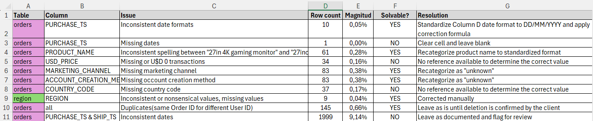
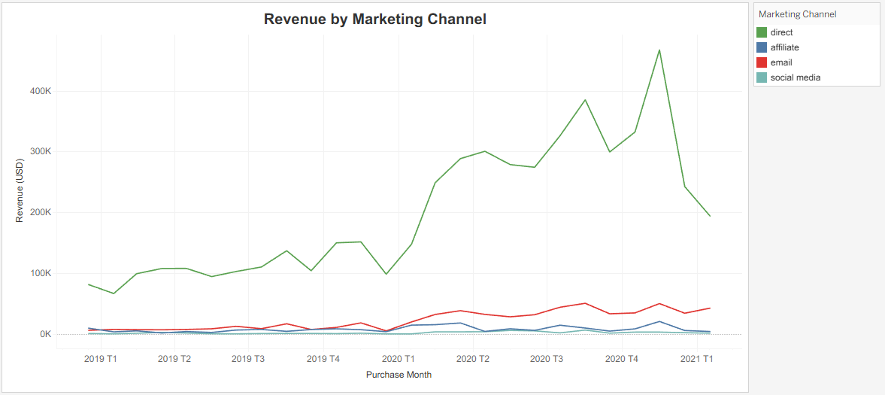
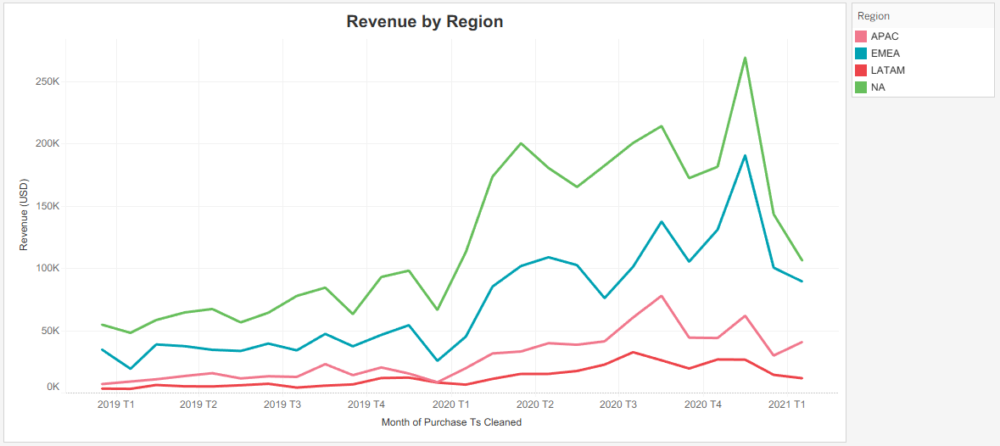

#  GameZone Orders Data Analysis


## Project Overview

This project demonstrates an end-to-end data analytics workflow using the **GameZone Orders Dataset**, a real-world e-commerce dataset containing **21,864 sales transactions**.

Starting from raw transactional data, I assessed data quality, cleaned and validated the dataset, performed exploratory analysis in Microsoft Excel, and built an interactive Tableau dashboard to uncover business insights.

### Interactive Tableau Dashboard

Explore the interactive dashboard on Tableau Public:

🔗 **[View Interactive Dashboard](https://public.tableau.com/app/profile/facundo.diaz.neto/viz/SalesDashboard-Gamezone/SalesPerformanceDashboard)**


---

## Project Workflow

```text
                                                        Raw Dataset
                                                              │
                                                              ▼
                                                        Data Quality Assessment
                                                              │
                                                              ▼
                                                        Issues Log
                                                              │
                                                              ▼
                                                        Data Cleaning & Validation
                                                              │
                                                              ▼
                                                        Exploratory Data Analysis
                                                              │
                                                              ▼
                                                        Interactive Tableau Dashboard
                                                              │
                                                              ▼
                                                        Business Insights & Recommendations
```

---

## Tools & Technologies

### Software
- Microsoft Excel
- Tableau

### Excel Techniques
- Pivot Tables
- Conditional Formatting
- Sparklines
- Sorting & Filtering
- Lookup Functions (VLOOKUP)
- Date Standardization
- Text Parsing Functions

### Data Analytics Skills Demonstrated
- Data Quality Assessment
- Data Cleaning & Validation
- Exploratory Data Analysis (EDA)
- Business Insight Generation
- Data Documentation
- Data Visualization

---

## Dataset

- **Source:** GameZone Orders Dataset
- **21,864** transaction records
- **2** related tables (`Orders` and `Region`)
- Sales data covering **2019–2022**

---

## Project Objectives

- Assess data quality before analysis
- Clean and standardize inconsistent data
- Validate data integrity
- Generate business insights
- Develop an interactive Tableau dashboard

---

## Data Cleaning & Validation

A structured data quality assessment was performed before any analysis.

The cleaning process included:

- Date standardization
- Missing value handling
- Product name normalization
- Duplicate detection
- Data validation
- Documentation through a dedicated **Issues Log**

When insufficient information was available, records were preserved and documented instead of being modified.

### Issues Log



---

## Business Analysis

After cleaning and validating the data, exploratory analysis was performed using Excel Pivot Tables before building the Tableau dashboard.

The analysis focused on:

- Revenue trends over time
- Product performance
- Sales volume
- Average Order Value (AOV)
- Marketing channel performance
- Regional performance


### Pivot Table Analysis

*(screenshot - Pivot Table with Conditional Formatting and Sparklines.)*


---

---

## Tableau Visualizations

The final stage of the project consisted of building an interactive Tableau dashboard supported by several analytical worksheets to explore revenue trends from different business perspectives.

### Interactive Dashboard


### Overall Revenue

Monthly revenue trend across all products.


### Product Revenue

Revenue trends by product over time.


### Marketing Channels

Revenue generated by each acquisition channel.



### Regional Performance

Revenue trends across geographic regions.



---

---
## Key Findings

- **USD 6.1M** in total sales analyzed across 21,864 transactions.
- Revenue nearly doubled during 2020 before declining in 2021.
- December consistently recorded the strongest sales performance.
- Gaming Monitor, Nintendo Switch, and PlayStation 5 were the top revenue drivers.
- Direct was the highest-performing marketing channel.
- Similar revenue patterns were observed across all geographic regions.
---

## Repository Structure

```text
GameZone-Orders-Data-Analysis/

├── excel/
│   ├── GameZone_Orders_Cleaning.xlsx
│
├── tableau/
│   └── GameZone_Dashboard.twbx
│
├── images/
│   ├── dashboard_overview.png
│   ├── issues_log.png
│   ├── pivot_table.png
│   ├── tableau_overall.png
│   ├── tableau_products.png
│   └── tableau_marketing.png
│
└── README.md
```

---

## Highlights
🟩 Performed end-to-end data cleaning on a real-world dataset.

🟩 Identified and documented data quality issues before analysis.

🟩Built a reproducible data cleaning workflow in Excel.

🟩 Performed exploratory business analysis using Pivot Tables.

🟩 Created interactive Tableau dashboards.

🟩 Generated actionable insights for Finance, Marketing, and Product teams.

---
